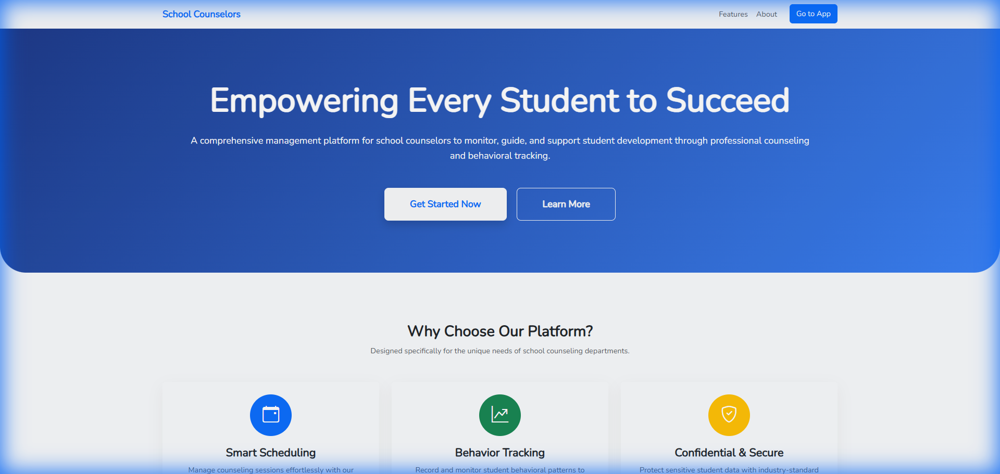
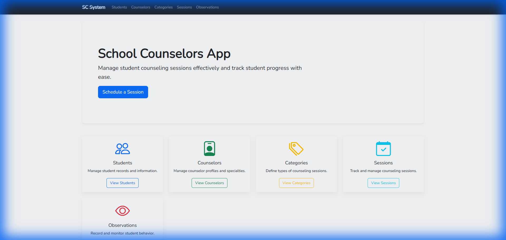
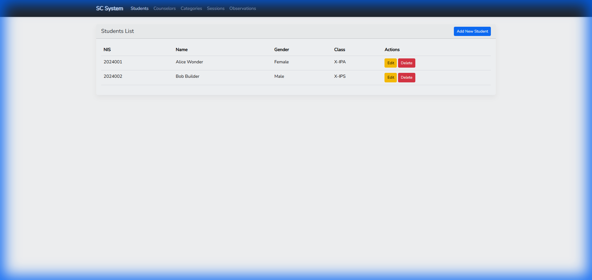
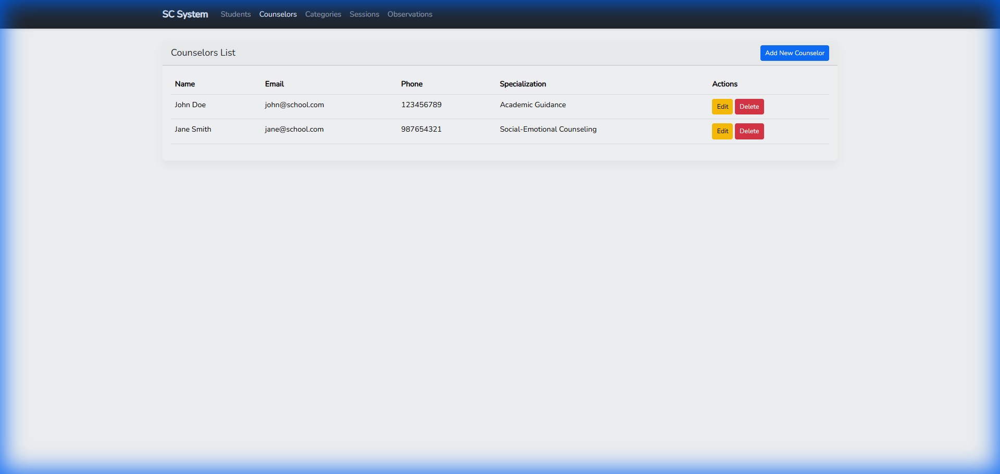
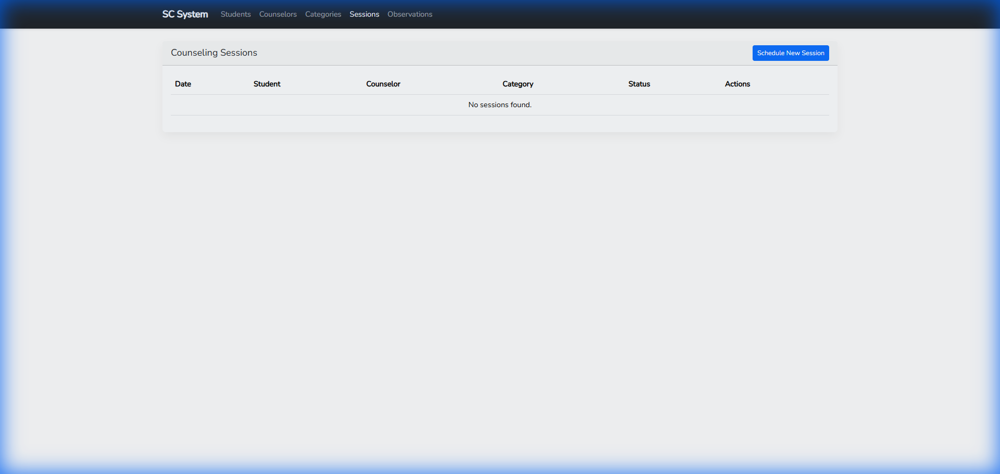
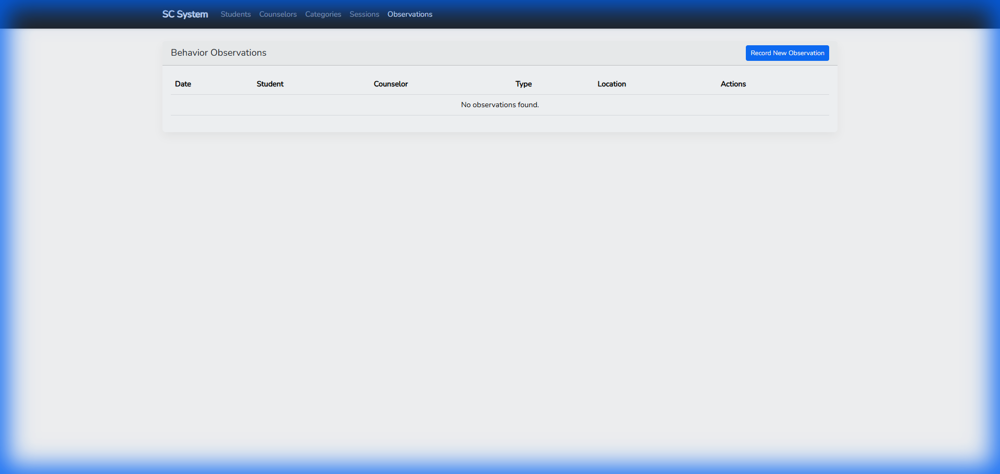

# Documentation: School Counselors Management System

## 📌 Project Overview

The **School Counselors Management System** is a dedicated web application designed to streamline the work of school counseling departments. It provides tools for managing student records, scheduling counseling sessions, and recording behavioral observations in a centralized and secure platform.

-   **GitHub Repository**: [https://github.com/suryo/school-counselors-laravel-10](https://github.com/suryo/school-counselors-laravel-10)
-   **Download App**: You can clone or download the source code from the link above.

---

## 🚀 Key Features

### 1. Master Data Management

-   **Student Profiles**: Store detailed information including Student ID (NIS), Name, Gender, Class, and Address.
-   **Counselor Directory**: Manage counselor profiles and their specific areas of expertise (e.g., Social, Academic, Career).
-   **Counseling Categories**: Categorize sessions for better reporting (Academic Guidance, Personal Issues, Career Direction, etc.).

### 2. Counseling Session Management

-   **Scheduling**: Schedule sessions with students and assign them to specific counselors.
-   **Tracking**: Monitor the status of sessions (Scheduled, Completed, Cancelled).
-   **Documentation**: Record detailed notes for each session for future reference.

### 3. Behavioral Observation Tracking

-   **Real-time Recording**: Document student behavior as it happens at school.
-   **Categorization**: Tag behaviors as Positive, Negative, or Neutral.
-   **Action Plans**: Record the location of the incident and any immediate action taken by the counselor or teacher.

### 4. Professional Landing Page & Dashboard

-   **Landing Page**: A stunning introduction with a hero section and feature highlights.
-   **Dashboard**: A clean administrative interface for quick access to all modules and statistics.

---

## 📸 System Screenshots

### Landing Page


_Professional landing page showcasing the system's mission._

### Dashboard Overview


_Central dashboard for quick navigation and monitoring._

### Student Management


_Managing student records and basic information._

### Counselor Directory


_Profiles and specializations of the counseling team._

### Counseling Sessions


_Detailed tracking of scheduled and completed sessions._

### Behavior Observations


_Recording behavioral incidents and taking corrective actions._

---

## 🛠️ Technical Architecture

### Core Technologies

-   **Framework**: Laravel 10 (PHP 8.2+)
-   **Frontend**: Bootstrap 5.3 & Bootstrap Icons
-   **Database**: MySQL (Eloquent ORM)
-   **Asset Manager**: Vite

### Database Schema

-   **`students`**: Basic student information.
-   **`counselors`**: Counselor profiles and specializations.
-   **`categories`**: Types of counseling sessions.
-   **`sessions`**: Mapping students, counselors, and categories with dates and notes.
-   **`behavior_observations`**: Tracking student behavior incidents and actions.

---

## 📦 Installation Guide

### Prerequisites

-   PHP 8.2 or higher
-   Composer
-   Node.js & NPM
-   MySQL Server

### Step-by-Step Installation

1. **Clone the Repository**:
    ```bash
    git clone https://github.com/suryo/school-counselors-laravel-10.git
    cd school-counselors-laravel-10
    ```
2. **Setup Dependencies**:
    ```bash
    composer install
    npm install
    npm run build
    ```
3. **Configure Environment**:
    - Create a `.env` file from the `.env.example`.
    - Set your database credentials.
    - Run `php artisan key:generate`.
4. **Database Migration**:
    ```bash
    php artisan migrate --seed
    ```
5. **Start Application**:
    ```bash
    php artisan serve
    ```

---

## 📖 Usage Manual

1. **Login/Landing**: Start at the landing page to understand the system capabilities.
2. **Dashboard**: Navigate to the dashboard for administrative tasks.
3. **Adding Data**: Start by adding Counselors and Categories before Students to ensure relationships are established.
4. **Recording sessions**: Use the "Sessions" module to log student meetings.
5. **Observing behavior**: Use the "Observations" module for on-the-spot behavior recording.

---

## 📄 License & Support

This project is open-source. For support, please open an issue on the [GitHub repository](https://github.com/suryo/school-counselors-laravel-10).

---

_Generated by Antigravity_
